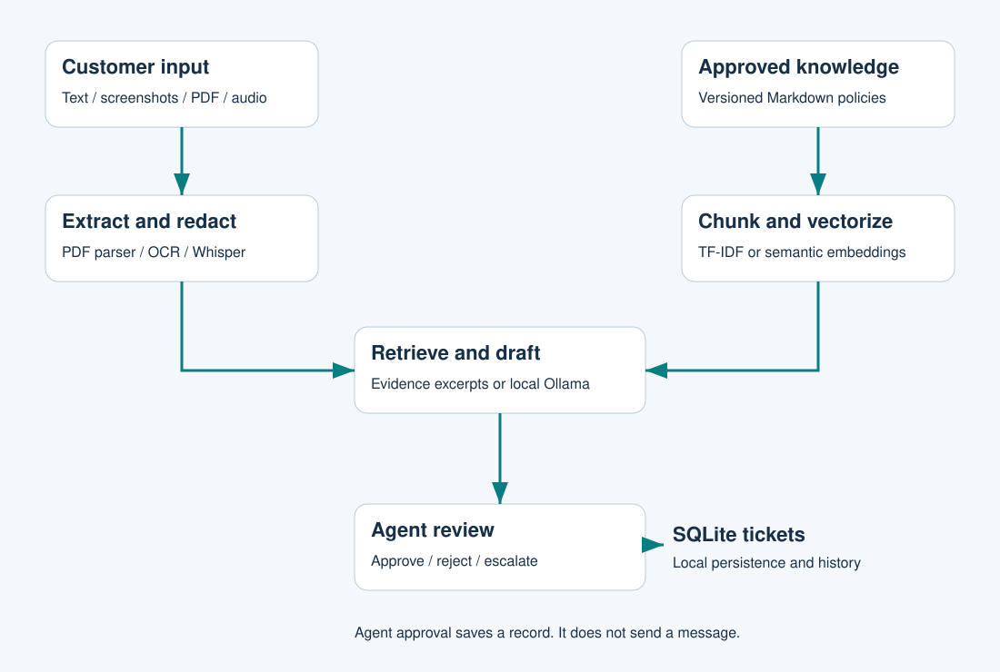

# Multimodal AI Customer Support Copilot

A local portfolio demo with synthetic policies and customer data.



## Run on Windows
```powershell
py -m venv .venv
.venv\Scripts\python.exe -m pip install -r requirements.txt
.venv\Scripts\python.exe app.py
```
Open http://127.0.0.1:8000. Ask `My payment failed with PAY-402`.
On macOS/Linux use `python3 -m venv .venv` and `.venv/bin/python`.

## Features
Text/PDF extraction, Tesseract screenshot OCR, cited TF-IDF retrieval, editable drafts, SQLite tickets and agent approval/escalation. Approval does not send a message.

Optional audio: install `requirements-audio.txt` and allow the Whisper model download.
Optional neural embeddings: install `requirements-semantic.txt` and set `SEMANTIC_SEARCH=1`.
Optional LLM: install Ollama and a chat model, set `OLLAMA_MODEL` to its installed name and enable drafting in the UI. Live model inference was not tested here. The default response is evidence extraction, not generation.

## Tests
```bash
python -m unittest discover -s tests -v
python scripts/evaluate.py
```
The recorded baseline passed 10 unit tests and 10 synthetic retrieval cases. These are not production accuracy metrics.

## Documentation
- [Complete PDF guide](docs/Project_Guide.pdf)
- [Full explanation](docs/FULL_GUIDE.md)
- [Excel evaluation workbook](reports/Project_Workbook.xlsx)
- [Workflow diagram source](docs/workflow.mmd)
- [Architecture SVG](docs/architecture.svg)
- [GitHub instructions](docs/GITHUB.md)
- [Validation details](reports/VALIDATION.md)

## Structure
`copilot/` contains retrieval, ingestion and ticket storage. `web/` contains the UI. `data/kb/` contains approved sample policies. `data/samples/` contains fixtures. `tests/` and `scripts/` contain validation. `docs/` and `reports/` hold documentation and results.

## Deployment scope
Local single-agent demo. Public hosting is not deployed. Repository: https://github.com/harshakavali81-collab/A-Multimodal-AI-Customer-Support-Copilot . Add authentication, stronger file isolation and operational controls before public deployment. See the guide for limits. No real customer records are included.
